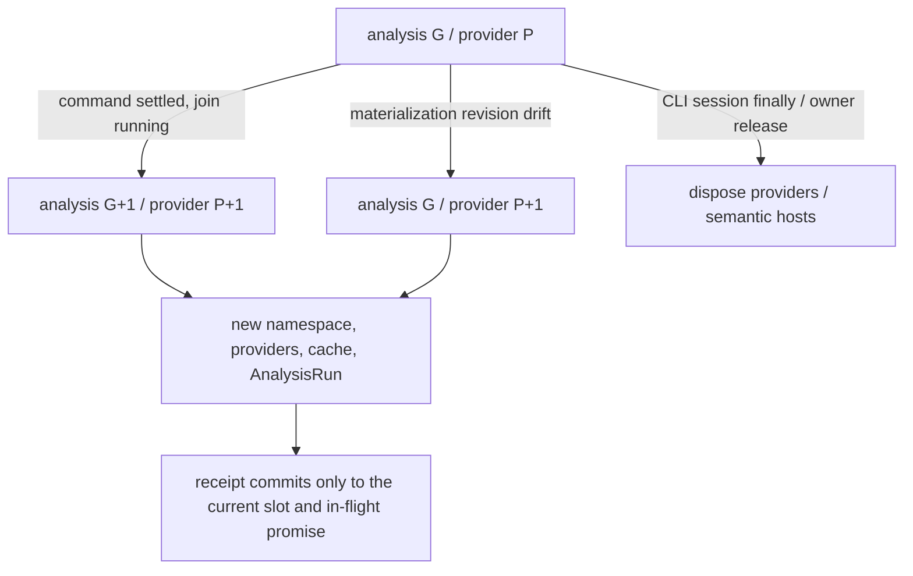

# Limina lifecycle and publication

[English](./limina-lifecycle.md) | [简体中文](./zh/limina-lifecycle.md)

This page owns the full explanation of generations, caches, disposal, artifact mutation, migration, and issue freshness. They protect analysis validity, write authority, publication integrity, and result freshness respectively; they cannot be collapsed into “all state belongs to one generation.”

## Runs, provider generations, and asynchronous publication

The [preflight manager](../../packages/limina/src/preflight/manager.ts) has `#generation` and `#providerGeneration`. A command boundary normally advances both. When base revision drift triggers a materialization replan, only providers, namespace, and caches refresh; the analysis task generation stays unchanged. The snapshot token includes the root and both generations. The numbers themselves are not physical file versions. `ResolvedLiminaConfig.governanceRoot` belongs to config resolution: the nearest manifest is read and validated once, then shared by root classification and root package construction. Provider refresh does not manufacture a second root-manifest fact; a new config resolution establishes a new root snapshot. This bounded snapshot does not freeze child manifests, the entire filesystem, or third-party tool reads.

[executor](../../packages/limina/src/execution/executor.ts) is the current production entry point for creating the generation controller. After command settlement marks an advance, [scheduler-loop](../../packages/limina/src/execution/scheduler-loop.ts) first joins running tasks and then calls startNextGeneration. The manager's [materialization slot](../../packages/limina/src/preflight/materialization.ts) checks the current slot and promise identity to prevent an old asynchronous result from overwriting a new receipt, and allows a new attempt after failure. Commands can change the filesystem, so clearing one query result while retaining old providers is insufficient.

A manager with injected custom providers supports only generation zero. Advance/replan checks run before disposal and replacement; failure does not silently substitute default providers. `dispose()` is idempotent, but most manager `ensure*` methods lack a uniform disposed guard. Do not claim that every subsequent API call is rejected. Production callers must stop using it when the run lifecycle ends; whether to enforce this mechanically is an [audit risk](./limina-architecture-audit.md#findings).

Locate release responsibility along the call chain: [CLI check-run](../../packages/limina/src/cli/check-run.ts) and [standalone](../../packages/limina/src/cli/standalone.ts) dispose their session in `finally`. [Graph export](../../packages/limina/src/graph-check/runner.ts) disposes only preflight it created itself; borrowed preflight/custom providers remain the caller's responsibility. Lower-level [pipeline execution](../../packages/limina/src/pipeline/execution.ts) can create preflight but lacks uniform disposal in finally. Repeated direct calls to that internal API cannot borrow the CLI's lifecycle guarantee. An immutable view of a domain aggregate does not change these actual ownership responsibilities.

## Cache identity and capability scope

| Cache / context                                                            | Key / lifetime owner                                                                                                                                                                       | Invalidation and limits                                                                                                                                                                                                                                                                                                                       |
| -------------------------------------------------------------------------- | ------------------------------------------------------------------------------------------------------------------------------------------------------------------------------------------ | --------------------------------------------------------------------------------------------------------------------------------------------------------------------------------------------------------------------------------------------------------------------------------------------------------------------------------------------- |
| Workspace, checker config, lookup, graph, route                            | [AnalysisProviderSet](../../packages/limina/src/core/index.ts) and preflight promises/caches                                                                                               | Provider replacement creates a new set; a path-keyed map is not a process-wide file-watching cache                                                                                                                                                                                                                                            |
| Region trie, canonical projection, exact classification, source config Set | A [WorkspaceRegionPathIndex](../../packages/limina/src/core/workspace/validated/path-index.ts) instance shared through the workspace provider's getPathIndex Promise                       | A provider-only replan also replaces the entire index; do not clear classification while retaining an old trie/projection. The [preflight regression](../../packages/limina/src/__tests__/preflight.spec.ts) rebinds an alias and adds a boundary while leaving the analysis generation unchanged                                             |
| Project dependency collection / preparation                                | [cache](../../packages/limina/src/core/project-dependencies/cache.ts): adapter, family, config/options/raw refs/roots, generation, package/resolver/framework identity, workspace boundary | Final collection additionally includes workspace export policy identity. A callback without identity disables the final cache; returned clones prevent callers from corrupting the cache                                                                                                                                                      |
| Native facts snapshot                                                      | [identity](../../packages/limina/src/core/typescript-semantic/identity.ts): config/options/roots/raw refs/admission boundary, etc.                                                         | Complete resolution/admission/evidence/requirement facts are copied before the full context ends; roots-only snapshot hasSourceFile() must not recompute admission. The key has no source content digest, so correctness depends on provider lifetime. The boundary affects ambient evidence; this is not a boundary-independent syntax cache |
| Native live context                                                        | [context](../../packages/limina/src/core/typescript-semantic/context.ts) owns the Program, ledger, resolver, and maps                                                                      | Methods reject operations after disposal; snapshots retain historical facts. A public readonly Program field does not imply physical object destruction or that the whole object becomes inaccessible                                                                                                                                         |
| Vue                                                                        | [manager](../../packages/limina/src/core/vue-semantic/context-manager.ts) and a process-wide active context slot                                                                           | Owners may share the same identity; switching identities replaces and disposes the old slot. The last owner release reclaims it. Each provider does not exclusively own a long-lived Vue Program                                                                                                                                              |
| Astro                                                                      | [context](../../packages/limina/src/core/astro-semantic/context.ts) managed by project seed/toolchain, with a lazy Program                                                                 | Snapshots incorporate current source text; manager disposal reclaims the context. External file changes remain bounded by overall provider lifetime                                                                                                                                                                                           |
| Svelte                                                                     | [context](../../packages/limina/src/core/svelte-semantic/context.ts) with one active project; project identity includes adapter/options/config closure/package/files/generation/profile    | Leaf-owned toolchain; per-file sourceText caches are separate from managed lookup identity. This is not a general incremental watcher                                                                                                                                                                                                         |

Native scope-evidence cache contracts are semantic context v4, native dependency facts v3, project dependency adapter v6, and pending dependency adapter v4. Pending clones also copy referenceRequirement. The native Core route reuses the existing provider/query caches, Symbol-keyed ambient cache, and bounded Program; one uncached project collection creates one context, not one per occurrence. `completeProject()` releases live handles while copied facts remain available; disposal rejects later live-context operations. [Provider evidence tests](../../packages/limina/src/__tests__/native-provider-evidence.spec.ts) assert Program creation counts, query reuse, snapshot parity, and release behavior; no performance improvement is assumed.

Project dependency identity includes compiler options/conditions, source files, authority, extensions, package roots, workspace boundary and generation. Native fact cache entries are also keyed by that project identity. Evidence snapshots are cloned and frozen on collection/cache boundaries; no live framework profile is retained. Runtime evidence is copied only when already observed, and cloning never resolves modules. [Project dependency regressions](../../packages/limina/src/__tests__/project-dependencies.spec.ts) exercise context changes, mutation attempts, native resources and generated framework observations.

Occurrence snapshots retain a SHA-256 digest of workspace boundary identity, memoized by the immutable boundary object in a WeakMap. The original identity contains the full path inventory: deep-copying it for every occurrence/cache clone multiplies workspace size by import count and exhausted the default 4 GiB heap during repository validation. The bounded-snapshot regression uses 10,000 workspace paths; differing membership still changes both the boundary digest and project identity. The weak memo does not retain a disposed boundary.

[FileOwnerLookup](../../packages/limina/src/core/build-graph/file-owner-lookup.ts) owns its lexical/canonical indexes and realpath cache within the current analysis/provider lifetime. New provider generations and replans construct fresh indexes from their respective membership inputs; a missing or retargeted path cannot borrow an old generation's owner. It is not a filesystem watcher and does not extend cache validity across arbitrary in-place filesystem edits.

**Derived**: Current caches fit controlled run/provider lifetimes. An external caller that reuses the same cache/request generation across file edits may receive old results when source content is absent from the key. This is not evidence that the existing CLI is necessarily stale. Supporting a long-lived daemon requires a mutation/version contract before extending cache lifetime.

## Provider-owned raw syntax reuse

[SourceSyntaxFactsCache](../../packages/limina/src/core/typescript-semantic/syntax-cache.ts) belongs to one `AnalysisProviderSet`. Project dependency collection and native TypeEvidence borrow that instance; neither consumer owns its disposal. Provider replacement (including a provider-only replan at the same analysis generation) creates a fresh cache, and provider disposal clears the entries. There is no persistent cache or process-global syntax store.

The bounded host captures [OwnedSyntaxInput](../../packages/limina/src/core/typescript-semantic/syntax-input.ts) only during a synchronous native Program creation. The recipe is currently audited for TypeScript **6.0.3**; other compiler versions/instances, foreign or framework ASTs, parse errors, unknown parser fields and calls outside that scope use the original collector. Expanding that recipe requires corresponding parser differential evidence. The descriptor contains lexical file name, compiler instance/version, collector version, language target/variant, script kind, implied format, JSDoc mode and native module-detection policy. A hit additionally requires exact text equality; no mtime or realpath substitution establishes equivalence.

Only text and ordered plain import records are retained. Records are copied on both insertion and return, with no AST, Program, Symbol, resolved target, admission, TypeEvidence or graph decision in an entry. A cache hit still initializes the new AST's parent pointers; each context independently records triple-slash/lib admission and resolution. Both consumers retain their existing semantic identities and policy interpretation. Program counts are not reduced by this optimization.

The initial LRU budget is 96 MiB of **estimated** text/string/object storage, with an 8 MiB entry limit. Oversized entries bypass; a descriptor retains only its latest text. Estimates are conservative bookkeeping rather than a heap/RSS guarantee. The cache reports hit/miss/bypass/eviction and current/peak estimated bytes; native Program construction and first TypeChecker request have distinct duration observations. Async phase wall time is not exclusive CPU time.

Executable counterexamples are in [cache lifecycle](../../packages/limina/src/__tests__/source-syntax-cache.spec.ts), [syntax differential](../../packages/limina/src/__tests__/source-syntax-differential.spec.ts) and [provider replan](../../packages/limina/src/__tests__/preflight.spec.ts). These cover content changes, consumer mutation, lexical aliases, malformed/foreign inputs, eviction, disposal, same-generation replacement, 70 synthetic sources and 432 foreign parser recipes. Full performance claims require a frozen-workload comparison; passing these tests alone does not establish a speedup.

## Source phase observations

[Source phases](../../packages/limina/src/source-check/phases.ts) separate read-only preparation, Knip execution/cleanup, and read-only ownership/authority/reporting. The runner executes them sequentially under the **existing whole-task resource declaration**. The public task remains `source:check`, and the final source result is published once. Knip failures or cleanup errors still prevent later phases from publishing success. Phase wall observations do not authorize concurrent readers while temporary Knip entries are visible, nor weaken manifest, repository, generated-file or cross-process lease constraints.

## Namespaces, physical identity, and plans

[namespace-core](../../packages/limina/src/domain/artifacts/namespace-core.ts) records the logical root, canonical root, and generation token, and authenticates through an internal WeakSet. An [artifact plan](../../packages/limina/src/domain/artifacts/plan.ts) is also authenticated and bound to the same token. Two freshly created namespaces with the same root and numeric generation cannot exchange plans. Production graph generation creates revisioned plans; an internal constructor for unrevisioned plans exists, so base-revision checking cannot be generalized to every API input.

Generated config identity is evaluated relative to the active workspace root. A `.limina` name in an ancestor directory must not misclassify a nested workspace's source config. [Mutation authority](../../packages/limina/src/utils/mutation/authority-create.ts) obtains canonical identity for a trusted base and checks the logical chain, scope, and containment. Locating an output does not automatically grant permission to mutate it.

[Identity checks](../../packages/limina/src/utils/mutation/identity.ts) combine lstat/open/fstat, content/hash, device/inode, links/metadata, and other checks to validate bindings. Logical symlink/junction, physical escape, and binding drift have separate rejection paths. These are concrete execution guards, not proof of absolute race freedom against every operating-system concurrency attack.

## Publishing and recovering generated artifacts

Generated declaration directories and incremental cache paths retain the complete source config basename, including `tsconfig.` and `.json`, within their existing checker and directory partitions. This distinguishes `tsconfig.json` from `tsconfig.tsconfig.json`. Planning rejects paths claimed by different source configs. Regeneration updates owned configs; stale cleanup uses the prior ownership ledger and does not recursively delete unowned compiler caches or user files. [Namespace guards](../../packages/limina/src/__tests__/artifact-namespace.spec.ts) and [graph regeneration tests](../../packages/limina/src/__tests__/generated-graph.spec.ts) cover path conflicts, old ownership ledgers and repeated preparation.

The production path through the [materializer](../../packages/limina/src/core/build-graph/materializer.ts):

1. Authenticate the namespace/plan and acquire the cross-process writer lease for the canonical root.
2. Read the base revision under the lease. On drift, perform at most one complete replan, requiring the same canonical lease root.
3. Write an in-progress marker containing the base/desired revision and owned-path universe.
4. Write desired files and delete old owned paths absent from the desired set; write the manifest last.
5. Verify the desired tree and remove the marker before completing the receipt.

After failure, the marker remains and a reader lease reports recovery required. The next writer recovers with a complete new plan, verifies it, and removes the marker. Manifest-last is part of the protocol, not a filesystem transaction that atomically writes multiple files. Recovery has no general journal or backup tree. Checker typecheck selects targets (including the empty-target decision) from the materialization receipt, after any replan. Its [read lease](../../packages/limina/src/core/build-graph/materialization-read-lease.ts) checks that the current artifact revision still matches that receipt before running a checker; drift fails explicitly and requires rerunning the command. Checker builds, selected checker builds, and managed output builds use the same receipt/revision handshake before compiler execution. A reader lease alone cannot authorize an in-memory classification against a newer generated closure; unrelated artifact consumers retain their separate contracts. [Regression coverage](../../packages/limina/src/__tests__/typecheck.spec.ts) changes leaves and package roots between planning and materialization, and replaces a receipt before acquiring its read lease.

[Manifest version](../../packages/limina/src/core/build-graph/manifest-version.ts) / [ownership](../../packages/limina/src/core/build-graph/manifest-ownership.ts) allow older formats only as cleanup ownership ledgers; production types define the current schema. At the time of inspection it was v5; v1–4 are not reused as current graphs. Future/invalid versions are rejected. Ordering uses code-unit comparison. Runtime capability descriptions and live source descriptors do not thereby become persisted graphs.

Namespace materialization governs managed generated artifacts. User-selected graph export files, external tool output from `build --raw`, and migration have different writer contracts. Do not claim that every disk write passes through the materializer. Managed checker output separately validates authority through [managed-mutation](../../packages/limina/src/typecheck/managed-mutation.ts) and [output](../../packages/limina/src/typecheck/output).

Cross-process holders publish immutable token-named owner records by directory rename. Reclamation removes only the observed record and then uses nonrecursive rmdir; a replacement holder has a different record and prevents removal of its nonempty directory. Release follows the same rule. Empty published slots left by interrupted cleanup are recoverable; unpublished reader candidates are excluded from reader membership and are never reclaimed as empty leases. Legacy `owner.json` records can be retired but are never newly published. This is a cooperative protocol among current Limina processes; concurrent older binaries that recursively remove holders are outside it. [Lease reclamation guards](../../packages/limina/src/__tests__/cross-process-lease-reclamation.spec.ts) delay both record deletion and directory removal while another writer acquires the slot.

A holder publication rename returning `EEXIST` or `ENOTEMPTY` already establishes contention; retry even if that holder releases before the follow-up inspection. Requiring it to remain present turns a valid release into a fatal persistence error, including during check-index publication. Ambiguous Windows-style `EACCES`, `EBUSY`, and `EPERM` still require a present holder; unrelated I/O errors must propagate. Retry returns to the existing bounded acquisition protocol and does not bypass owner validation, stale-owner reclamation, or latest-attempt checks. [Publication guards](../../packages/limina/src/__tests__/cross-process-lease-holder.spec.ts) cover a real POSIX collision followed by release, both definite error codes with an absent holder, and permission/error controls. The [concurrent CLI regression](../../packages/limina/src/__tests__/cli.spec.ts) rejects persistence warnings and includes query stdout/stderr on failure. This preserves I11 publication integrity and I12 freshness; a bare CI query exit code alone does not identify which persistence failure occurred.

Exclusive declaration publication captures the new empty file identity before writing, syncing or reading it back. Failure retains that identity for rollback; incomplete content must still be a prefix of the intended bytes, with matching device/inode/mode/link count. Verified files retain full content-hash checks. Parent directories enter the transaction ledger one at a time, before creating the next directory, so a later failure cannot discard earlier cleanup ownership. Unreadable identity or external replacement never grants deletion authority. [Publication failure guards](../../packages/limina/src/__tests__/output-publication-failures.spec.ts) inject partial writes, sync/readback failures, directory failure and replacement, and check retry plus user-file preservation.

## Migration is a separate transaction

The [migration planner](../../packages/limina/src/commands/migration/planner.ts) freezes one config overlay, topology edits, dependency comparison, JSONC patches and physical snapshots before writing. Candidate descriptors, default checker entries and managed source closures remain different sets. [InputTopologyResult](../../packages/limina/src/core/build-graph/input-topology.ts) reuses normal workspace, entry and source/solution readers. DependencyAnalysisResult separates completed semantic facts from projection/governance diagnostics; incomplete analysis is never an empty proven graph. Generation-local config overlays reach parser, ownership evidence, semantic hosts and cache identities. They do not add manifest fields or persistent partial-graph authority.

Unreadable files are preserved. Exact `regions.exclude` of kind `tsconfig` is applied before output reading without deactivating the package; all affected memberships and implicit references must be pruned. Static config syntax editing preserves modules rather than serializing evaluated exports. Unsupported dynamic exports, ambiguous JSONC, existing visibility cycles without a safe baseline, or solution declarations that cannot be isolated without losing healthy membership leave an explicit incomplete result. Named pure wrappers expand with rebased paths; default solution cycles preserve source reachability through compensating membership. No `extends` removal or native build equivalence is promised.

Compiler options remain intact. Existing valid output contracts win over native values; effective noEmit, declaration-only, outFile and split directories constrain optional output adoption. [Output trials](../../packages/limina/src/commands/migration/output-adoption.ts) add proposals in stable path order and run the whole candidate input chain. Directory safety alone is insufficient: descriptor stability, retained entries and each entry/solution's source reachability must survive. A proposal that hides itself or another healthy source is rejected without isolating that source. A failed baseline is not an empty protected set; no combination search or post-write replanning occurs. [Migration topology tests](../../packages/limina/src/__tests__/migration-topology.spec.ts) and [published CLI coverage](../../packages/limina/integration/tests/migration.spec.ts) own these contracts.

[Commit groups](../../packages/limina/src/commands/migration/commit-groups.ts) couple edits of a solution cycle or a shared required isolation; independent files do not join a workspace-wide rollback. Edits targeting the same config path are coalesced before execution; different paths aliasing one physical file are rejected. Git roots and dirty-worktree confirmation retain their existing authority boundary. [Transaction execution](../../packages/limina/src/commands/migration/transaction/execution.ts) preserves identity/content/metadata checks, atomic single-link replacement, and explicitly non-atomic in-place hardlink writes. Recoverable group failures restore that group and allow independent progress. Uncertain mutation or rollback stops with recovery evidence. Input drift after prompts invalidates the frozen plan; no cross-process writer lease is claimed.

[Fresh-process verification](../../packages/limina/src/commands/migration/verification.ts) loads actual disk configuration for normal check/graph input consumption, without overlays or reports. Required write failure, missing protected membership, structural failure, no governed source or unavailable verification prevents successful adoption. Optional output rejection alone does not. The independently published `.limina/migration/latest.json` records processing, comparison, conversion, writes and verification; publication failure warns without rolling back configs. Reports grant no graph or later-migration authority. See the [CLI contract](../../docs/en/cli.md#limina-migration) for editable module shapes and exit semantics.

POSIX checker execution tracks the owned process group through termination, including after its leader exits. Natural leader completion starts descendant cleanup even without cancellation; successful cleanup retains the leader’s original exit status. Escalation is not cancelled by the leader’s close event. The runner waits for pending group cleanup before reporting completion, and the checker host retains the group until cleanup settles, including during host shutdown. Cleanup has a bounded timeout reported as a failed measurement. [Process-group tests](../../packages/limina/src/__tests__/process-tree.spec.ts) use responsive/stubborn descendants, an already-exited leader and direct/host execution. These tests do not establish Windows taskkill descendant behavior.

## Issue identity and freshness

Command help is a completed CLI outcome. CAC clears its matched command after printing help, so the CLI records the matched state during help rendering before applying the unknown-command guard. Global and nested help do not load configuration or create governance artifacts; unknown commands still fail, including when help was requested. The [CLI tests](../../packages/limina/src/__tests__/cli.spec.ts) exercise real processes and these side-effect controls.

Inline terminal write tracking keeps the original Writable receiver when forwarding chunks and restores the exact original method afterward. A stream shared by stdout and stderr is patched only once. Buffer/string encodings, callbacks and backpressure remain the stream’s responsibility. [Real Writable tests](../../packages/limina/src/__tests__/terminal-frame.spec.ts) cover both write overloads and the complete inline reporter. The normal subprocess renderer and status-only reporter are separate paths; this protects the inline fallback when no subprocess renderer is available.

Finding producers retain typed semantic facts; issue projectors compose stable identities, deduplicate, and sort by domain. Different semantic findings at one location must not be swallowed because their display fields match. [check-reporting](../../packages/limina/src/check-reporting) defines the canonical issue inventory; terminal presentation does not determine fact identity.

[check-attempt-io](../../packages/limina/src/source-check/snapshot/check-attempt-io.ts) publishes sequence, attempt identity, and started metadata. On completion it commits `last-run.json` and the latest-completed metadata/digest that authenticates it. An older completion cannot supersede a newer sequence. Current [snapshot types](../../packages/limina/src/source-check/snapshot/types.ts) are check v8 and source v1. The standalone [invocation snapshot](../../packages/limina/src/check-reporting/invocation-snapshot.ts) is a separate v1 schema with an independent invocation ID. Do not conflate these three versions. Reader and writer rejection messages derive the supported check version from `CHECK_ISSUE_SNAPSHOT_VERSION`; old/future check wire models are still rejected. [Snapshot tests](../../packages/limina/src/__tests__/source-snapshot.spec.ts) and [completed-attempt tests](../../packages/limina/src/__tests__/check-attempt.spec.ts) cover invalid writes, version rejection, and coherent metadata whose snapshot uses an old version.

`check --issues` queries persisted state without running a new check. Its `QueryConfigAnchor` is distinct from an `ExecutionConfigLocation`: explicit paths are resolved lexically against cwd and need not exist. The locator searches from their dirname for the nearest manifest and validates that object without classifying membership, importing config, evaluating config functions or constructing preflight. Without an explicit path, it discovers a currently existing default config. It never redirects missing records to an ancestor workspace. Emitted invocation commands bind the absolute config, Node executable and installed Limina binary; [replay coverage](../../packages/limina/src/__tests__/single-package-cli.spec.ts) removes the config and verifies identical persisted state and no additional config execution. Latest running/interrupted/aborted/persistence-failed/corrupt metadata, or an inconsistent completion pair, forbids fallback to an old inventory. A corrupt latest attempt also blocks allocation of a new sequence. Explicit standalone invocation queries have their own input validation and are not the latest full check.

Completion, failure, not-run, and unavailable inventory must be reported separately. Machine JSON/NDJSON and human text may present them differently, but unavailability must not be reported as zero issues in the current run. Performance observations from `LIMINA_PROFILE=1` do not change issue authority. Atomic profile/snapshot writers do not imply cross-file atomicity for the entire check.

Custom-condition DAG summaries retain sets of existing diagnostic identities, with one finding object per identity in the phase context. Shared paths merge identities instead of copying a diagnostic array once per reference path; default and named domains share the emitted-identity set and publish findings in stable identity order within each pass. Project-path reachability and expected/actual conditions remain intact. This bounds stored diagnostic slots by projects times distinct mismatches rather than the number of paths; it is not a claim of linear total memory, because reachability sets remain transitive. [Adversarial DAG tests](../../packages/limina/src/__tests__/condition-subtree.spec.ts) compare a direct-edge oracle, reversed project order, deep/wide diamonds, equal conditions and overlapping domains.

## Release registry snapshot lifetime

[Release command execution](../../packages/limina/src/commands/release/command.ts) loads registry configuration inside the guarded command flow, before entry scheduling. Environment values and relevant npmrc entries are copied once, then each dependency selects its authority from that captured configuration. The authority travels through metadata, baseline and tarball calls; request helpers do not reread process environment. Metadata reuse remains local to a release consistency state and is keyed by the full normalized registry base URL plus package name. It never caches an importer's baseline/ignore decision. Later file/environment edits affect a later invocation. See [release network authority](./limina-system-model.md#release-registry-authority) for URL and response limits; this snapshot does not change provider-generation or issue-attempt lifetime.
