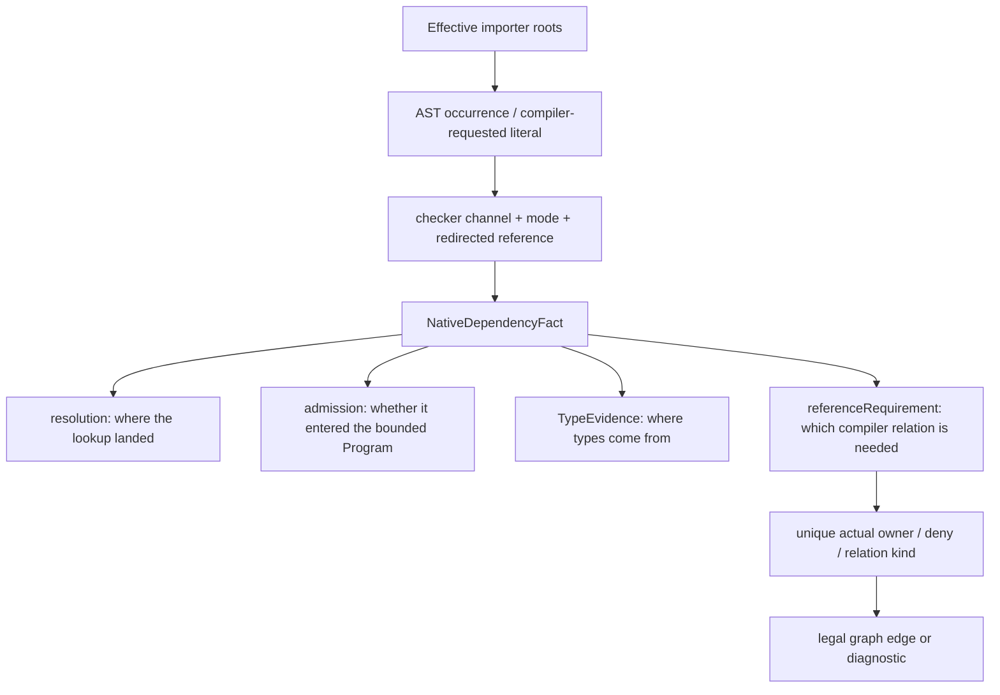

# Limina semantic facts

[English](./semantics.md) | [简体中文](./zh/semantics.md)

This page explains how dependency facts are produced and the limits of their capabilities. Entity and relation definitions belong to the [system model](./system-model.md); properties that must not change accidentally belong to [I02–I07](./invariants.md). This page describes the current adapters, without claiming complete equivalence to every version of the upstream checkers.

## From ownership candidates to a locked context

[checker-ownership-resolution](../../packages/limina/src/core/build-graph/checker-ownership-resolution.ts) performs discovery, root evidence collection, dependency fact collection, and requirements convergence before freezing semantic authority; Vue promotion, build coloring, and finalization follow. [semantic-authority](../../packages/limina/src/core/build-graph/checker-semantic-authority.ts) accepts only explicit, config, root-file, and dependency evidence for a semantic lock. Build-closure, fallback, solution-constraint, and vue-promotion do not rewrite semantics.

Pending discovery uses the bounded native TypeScript context from [pending-facts](../../packages/limina/src/core/build-graph/checker-ownership-pending-facts.ts). Framework inference accepts only qualified `missing + pending-framework-candidate` facts. During [physical candidate](../../packages/limina/src/core/build-graph/checker-ownership-physical-candidate.ts) bootstrapping, Oxc supplies a physical candidate, but a known framework extension, governed effective membership, a unique config, and a semantic domain are also required to form an ownership requirement. An ordinary TS/resource path does not lock a framework merely because a physical lookup succeeds. Native source requirements support compilation, not framework semantic authority. A physical declaration resolution blocks Oxc bootstrapping even when evidence is missing. A specifier that carries a query or fragment, such as `./Widget.svelte?x`, never bootstraps a physical candidate either: without a checker target, Limina has no authority to reinterpret host syntax through Oxc or the filesystem. Vue custom profiles are matched using the owner-registered path after canonical fallback.

A locked [ProjectSemanticContext](../../packages/limina/src/core/project-dependencies/contracts.ts) requires `LockedSemanticAuthority` at the type level. It has a different entry point from pending discovery. Copying authority in a constructor is not complete runtime authentication of an arbitrary forged JavaScript object. Production calls are constrained by the solving flow and type boundary; this must not be described as an unforgeable security capability.

## Native semantic inputs for a project

[effective-roots](../../packages/limina/src/core/typescript-semantic/effective-roots.ts) uses the checker's parsed roots and resolves relative entries in effective `compilerOptions.types` to produce deduplicated importer roots. Declaration files may be roots. `ownedFileNames` serves ownership and coverage; transitive Program files serve type interpretation. Neither can replace importer enumeration.

[context](../../packages/limina/src/core/typescript-semantic/context.ts) builds a full bounded Program by default. The [project-dependencies provider](../../packages/limina/src/core/project-dependencies/provider.ts) creates one context per uncached collection, processes all roots, captures a snapshot, and disposes it in `finally`. It neither selects `root-facts` nor creates a Program per occurrence. Root-facts is a separate, narrower admission mode and does not describe the production locked provider.

The [admission ledger](../../packages/limina/src/core/typescript-semantic/admission.ts) admits effective roots, raw project references, explicit path/type references, libs, allowed external module targets, and declaration closures by reason. The resolver can find an ordinary workspace module target without admitting it into the Program. Relative declaration closures from external declaration importers still pass through the workspace source boundary incrementally. That boundary matches both lexical and realpath identities and provides only Boolean membership, without owner, provenance, or policy.

Raw references come from the user's source/resolver config. References inferred by the generated graph do not feed back into this input: otherwise a new relation would change the evidence that produced it and justify itself. `resolveJsonModule`, explicit roots, reference inputs, and external library inputs remain subject to their respective TypeScript and ledger conditions; this cannot be summarized as “all non-root files are rejected.”

## Occurrences, evidence, and graph requirements

The four fact fields in the diagram are parallel dimensions. Following the arrows must not turn a path, Program membership, and type provision into synonyms. [import-resolver](../../packages/limina/src/core/typescript-semantic/import-resolver.ts) and [module-records](../../packages/limina/src/core/typescript-semantic/module-records.ts) record occurrence mode and redirected references; triple-slash path, types, and libs use their respective compiler channels. JSX synthetic literals are recorded only when TypeScript actually requests them, not merely from the `jsx` field. Under the same configuration, preserve may also request the JSX type runtime.

The native evidence contract (reviewed against implementation on 2026-09-16) is owned by [provider-evidence](../../packages/limina/src/core/typescript-semantic/provider-evidence.ts) and [dependency-fact](../../packages/limina/src/core/typescript-semantic/dependency-fact.ts). Ordinary module and JSX occurrences first inspect the bounded checker's Symbol for pure ambient declarations, then require a real SourceFile declaration identical to the current Program's provider object, including project-reference redirects. Evidence kind uses that provider's `isDeclarationFile`; evidence `filePath` records its actual path. Resolution, existence, suffix, or Program membership alone cannot prove type provision. An admitted script without a module Symbol remains missing. JSON, CommonJS, and augmentation follow their actual compiler behavior without a universal `isExternalModule()` requirement.

Explicit path/types/lib channels use the legal compiler input and actual current SourceFile, without requiring an import Symbol. A pragma without an actual compiler result cannot manufacture a provider. Admission tests the original physical target's Program identity: a source redirected to an output declaration remains excluded as source.

| Resolution and current scope                                          | Admission                       | TypeEvidence                                        | referenceRequirement                                                                 |
| --------------------------------------------------------------------- | ------------------------------- | --------------------------------------------------- | ------------------------------------------------------------------------------------ |
| No physical target, pure ambient                                      | unresolved                      | ambient                                             | null                                                                                 |
| Local/paths source, ambient provides types, membership not covered    | Actual target membership        | ambient                                             | compiler-membership                                                                  |
| Ambient with external-library source or covered compiler input        | May be excluded                 | ambient                                             | null                                                                                 |
| Occurrence has an actual implementation provider in this Program      | Original target membership      | checker-source at actual provider                   | source-semantic                                                                      |
| Source target without an effective provider                           | excluded or admitted            | missing                                             | source-semantic                                                                      |
| Raw project reference redirects source to existing output declaration | Original source may be excluded | concrete-declaration at output path                 | null; existing reference remains                                                     |
| Raw reference output is absent                                        | excluded                        | missing                                             | source-semantic candidate; deduplicate existing relation and preserve compiler error |
| Physical declaration target                                           | Actual target membership        | Actual concrete/ambient provider, otherwise missing | null                                                                                 |
| No target and no provider                                             | unresolved                      | missing                                             | null                                                                                 |

A physical declaration or actual declaration provider stops new source relations. Requirements are candidates; owner, deny, checker capability, declaration provider selection, and deduplication still decide the final relation. Same-owner facts do not create self-edges. Augmentation remains checker-source only when the occurrence actually has an implementation provider; excluded augmentation can remain missing with a source requirement.

The complete module specifier is the semantic identity (reviewed against implementation on 2026-09-21). `./foo.ts`, `./foo.ts?raw`, `./foo.ts?x=1`, and `./foo.ts#fragment` are four different requests. Limina hands each of them unchanged to the checker: it does not strip a query or fragment, does not treat the presence of one as resource or runtime evidence, and does not promote the existence of `./foo.ts` into a resolution, an admission, or a compiler relation for a queried occurrence. `import raw from './foo.ts?raw'` with `declare module '*?raw'` yields `resolution.target = null`, ambient TypeEvidence, and a null referenceRequirement; without the declaration it stays missing with a null requirement and is not repaired to `./foo.ts`. Program membership of `foo.ts` through `files`/`include` is a separate fact that the queried occurrence neither creates nor consumes. A checker that does resolve a queried request, for example through an exact `paths` key, is accepted as is, because the query has no dependency meaning of its own; only the checker's semantic facts have one. Confirmed: this is the current implementation, and no host query semantics exist in this version. Candidate: an explicit host authority for such syntax could be introduced later, but nothing in the current code or configuration provides it.

`ProjectDependency.targetKind` independently classifies the physical resolution through [declaration-classifier](../../packages/limina/src/core/import-graph/declaration-classifier.ts); it is not derived from TypeEvidence and adds no second persistent classification. The TypeScript provider and Core's native branch share NativeDependencyFact through existing query/provider caches, accepting ambient, missing, and redirected declarations without path-based replacement. Managed-output attribution decorates only proven declaration evidence, using its actual provider path. Framework PreparedDependencyFact validation retains its stricter source/target contract.

[native-provider-evidence.spec.ts](../../packages/limina/src/__tests__/native-provider-evidence.spec.ts) checks Program/Symbol identity, built/unbuilt references, actual provider paths, diagnostics, cache reuse, and disposal. [native-reference-repair.spec.ts](../../packages/limina/src/__tests__/native-reference-repair.spec.ts) covers ambient/augmentation distinctions; [generated-graph.spec.ts](../../packages/limina/src/__tests__/generated-graph.spec.ts) connects facts to relation assertions and real compiler builds. [Resource module tests](../../packages/limina/src/__tests__/resource-module-findings.spec.ts) distinguish present declaration companions from bounded type providers. A `resource` observation carries runtime classification and at most checker-source TypeEvidence. Ambient provision without a compiler relation is a `semantic-only` observation: an ambient module declaration proves that the checker can type the specifier, not that a physical runtime resource exists. observation.kind does not determine TypeEvidence.kind.

Ordinary runtime-like import inspection has a separate TypeScript syntax pass and Oxc resolver route. Those APIs do not share every restriction of the locked checker. Oxc is not consulted for a specifier that carries a query or fragment; its full-path result would encode bundler query semantics that Limina does not adopt, so runtime interpretation remains unsupported unless the checker supplies a framework source target. Even passing the complete string to a filesystem path normalizer is unsafe: `./absent.ts?x/../style.css` would collapse to `./style.css`. Runtime inspection and missing-provider diagnostics therefore stop before path normalization for such requests; the checker's actual source/declaration result and compiler relation remain intact. Native CommonJS recognition checks lexical bindings: shadowed `require` is excluded, and `createRequire(import.meta.url)` is accepted only through a direct immutable binding. Mutable, indirect, computed, and similar forms are not automatically interpreted as loaders. Evidence is in [typescript-imports](../../packages/limina/src/core/import-analysis/typescript-imports.ts) and its tests.

The [dependency evidence snapshot](../../packages/limina/src/core/project-dependencies/evidence.ts) preserves occurrence, mode, checker outcome and target, available runtime evidence, native admission/provider/requirement facts, framework mapping provenance, and context/generation identity through dependencies, observations, failures and cache clones. Runtime evidence stays independent; absent evidence means unobserved, not missing. Snapshots are copied and recursively frozen. Ownership uses actual checker targets and the current workspace snapshot; a raw package name is only a diagnostic lookup, never target attribution.

Package resource resolution preserves occurrence mode and custom conditions. Null targets, exact package-import keys, and the Node-owned `module-sync` / `node-addons` conditions use a resolution-only Node probe; unresolved package metadata also falls back to that probe. The probe inherits the process switches that enable or disable those default conditions instead of hardcoding them across Node versions. This produces physical runtime evidence only, never TypeEvidence or a compiler relation. [Condition guards](../../packages/limina/src/__tests__/resource-resolution-conditions.spec.ts) compare imports and exports with the running Node resolver.

## Locked resolution and framework preparation

The locked routes in [checker-resolution-provider](../../packages/limina/src/core/import-analysis/checker-resolution-provider.ts) set Oxc to null. A checker miss stays a miss; runtime/resource classification cannot supply a semantic target. This restriction applies to that call chain and must not be expanded into “Oxc never produces evidence anywhere in Limina analysis.” Astro pre-semantic eligibility skips only known virtual specifiers, plain explicit non-source extensions, and Oxc-identified resource targets; query or fragment syntax is not a skip authority, so the complete specifier reaches the Astro adapter and its result is accepted as is.

[PreparedDependencyFact](../../packages/limina/src/core/framework-semantic/contracts.ts) preserves strict provenance from generated occurrences to source, together with checker evidence. [dependency-record](../../packages/limina/src/core/project-dependencies/dependency-record.ts) checks both the target path and TypeEvidence kind. A source/declaration kind mismatch, or a claim of source/concrete evidence without a target, cannot enter the graph. `resolvedBy` records resolution provenance; TypeEvidence records the kind of type provision. They must be recorded separately.

| Family     | Actual semantic channel                                                                                                                                                                                 | Limits that must be preserved                                                                                                                                                                                                                        |
| ---------- | ------------------------------------------------------------------------------------------------------------------------------------------------------------------------------------------------------- | ---------------------------------------------------------------------------------------------------------------------------------------------------------------------------------------------------------------------------------------------------- |
| TypeScript | Full bounded Program and native facts                                                                                                                                                                   | Provider collection enumerates effective roots; external environment closures may load without automatically becoming the importer set                                                                                                               |
| Vue        | The Vue source profile distinguishes native channels from the Vue host/service script; [resolution](../../packages/limina/src/core/vue-semantic/resolution.ts)                                          | A matching VueSemanticIdentity is required; ordinary native TS occurrences do not all need to pass through an SFC source map. Strict mapping failure cannot be repaired by arbitrarily selecting another mapping segment                             |
| Astro      | Lazy language-service Program, Astro type environment, and generated snapshots in [context](../../packages/limina/src/core/astro-semantic/context.ts); other native channels may use TS                 | Roots, config, and toolchain determine the context; being able to read an adjacent extension is not equivalent to supporting the complete framework checker                                                                                          |
| Svelte     | Leaf-owned svelte2tsx / compiler / TS, with the TS host resolving generated scripts; [module-resolution](../../packages/limina/src/core/svelte-semantic/module-resolution.ts) preserves occurrence mode | Explicit `.svelte` resolution does not pass occurrence mode. A virtual `.d.svelte.ts` maps back to source only when that source exists and no real `.svelte.d.ts` exists; real declarations take precedence, with no second package exports resolver |

The Svelte adapter covers source transformation, the generated host, strict source mapping, and that host's module resolution. It does not load the complete `svelte.config` / preprocess pipeline and cannot promise equivalence to every svelte-check configuration. Native `.ts/.js` files still use native root/fact enumeration. In the generated graph, Astro/Svelte are complete leaf typecheck targets; they do not receive declaration wrappers or transparent build solutions.

Toolchain provenance, accepted versions, and capability checks are defined by the concrete resolvers/runtimes in [checker](../../packages/limina/src/checker) and the framework contexts. An adapter accepting a version range establishes only the code's admission conditions; tests with an installed tuple establish only that tuple's cases. Other minors, Windows, and uninstalled optional checkers still need their own validation.

Concrete tuple owners are [Vue compatibility](../../packages/limina/src/checker/vue-semantic-compatibility.ts), [Astro compatibility](../../packages/limina/src/checker/astro-semantic-compatibility.ts), and the [Svelte toolchain](../../packages/limina/src/core/svelte-semantic/toolchain.ts). Vue resolves Language Core/Volar/TypeScript from vue-tsc; Astro resolves the compiler from the check-owned Language Server. Workspace-root retries must not hide missing leaf dependencies. Paths provide provenance and instance identity, not a pnpm-layout compatibility predicate.

As of **2026-10-01**, Astro check admission uses the shared external-checker contract `>=0.9.6 <0.10.0` and its existing `includePrerelease: true` policy. Language Server, compiler, and Volar retain their exact tuple requirements and internal API shape checks; unsupported combinations still fail closed under [I04](./invariants.md). The [Astro toolchain guard](../../packages/limina/src/__tests__/astro-semantic-toolchain.spec.ts) exercises version and prerelease boundaries, while the [packed consumer guard](../../smoke/consumer.spec.ts) exercises installed `0.9.6` with TypeScript `5.9.3` and `0.9.10` with TypeScript `6.0.3`. These cases do not establish compatibility for every future patch or prerelease.

Svelte [source-mapping](../../packages/limina/src/core/svelte-semantic/source-mapping.ts) requires explicit segments to map every UTF-16 offset of a generated dependency continuously and monotonically to the current source. Partial coverage, cross-source mappings, or discontinuity produce a mismatch; entirely unmapped input remains an unmapped observation. [generated-script](../../packages/limina/src/core/svelte-semantic/generated-script.ts) constructs TraceMap without a map URL to avoid rebasing an absolute Windows source drive again. Vue/Astro use their own mapping algorithms for full-token/inner-content mapping, ambiguity, and mismatch; one framework's map conditions cannot be applied to all frameworks.

Actual consumer occurrences supply package export resolution. Graph check and graph export consume the same retained checker facts; neither builds an eager exports index, tries a second profile, or uses runtime evidence to repair a checker miss. Self-name, conditions and framework mapping follow the selected checker. [Vue guards](../../packages/limina/src/__tests__/vue-semantic.spec.ts) and [Astro/native guards](../../packages/limina/src/__tests__/workspace-export-resolution.spec.ts) use real consumers; Svelte guards use generated component dependencies. Conditional behavior remains toolchain-version dependent.

Native files in a Vue semantic context carry the module format computed by that same Vue-owned TypeScript instance, language-service host, and compiler options. The lazy SourceFile therefore selects the same import/require conditions as the eventual Program for .mts, .cts, and package-scoped .ts files, without constructing the Program just to determine format. [Vue semantic regressions](../../packages/limina/src/__tests__/vue-semantic.spec.ts) compare lazy resolution against the actual checker provider and assert the Program remains lazy.

The default native `tsc` execution uses Node with the `typescript/bin/tsc` entry resolved from the Limina installation, matching runtime dependency preflight and native semantic analysis. Execution-root `.bin` directories and ambient PATH cannot select another TypeScript version. Explicit internal runner command overrides retain their requested command and argument contract. [Command-origin tests](../../packages/limina/src/__tests__/checker-command-origin.spec.ts) verify the installed compiler version without PATH and preserve build/watch and override arguments.

## Configuration projection boundaries

Output target inheritance preserves the TypeScript array order even when sibling branches share an ancestor. The TypeScript configuration parser owns inheritance resolution, cycle diagnostics and effective options. Framework intent reads the actual parsed configuration closure, including package `tsconfig` entries, dotted names and extensionless files; failed parsing cannot silently fall back to a default target. [Compiler target regressions](../../packages/limina/src/__tests__/compiler-target.spec.ts) compare diamond, deep, repeated, reversed and own-override cases with the TypeScript parser.

[compiler-overrides](../../packages/limina/src/core/build-graph/compiler-overrides.ts) and the [generated readers](../../packages/limina/src/core/build-graph/generated) project generated roots/options from effective source config. When relative `types` entries have become explicit roots, remove relative configuration that would be reinterpreted in the generated directory. `extends` must also use effective values. Declaration and output projections apply the same root/type overrides using their own generated config paths. Explicit types are first enumerated by the source project's TypeScript instance and options, including its original typeRoots and config directory. This freezes TypeScript 6 wildcard expansion before generated fallback roots can enumerate ordinary node_modules packages as ambient types. Vue uses its owned compiler, so older compiler wildcard behavior is not silently upgraded. Named entries remain available alongside wildcard entries, and relative entries already represented by explicit roots are then removed. Explicit inherited typeRoots remain intact; automatically discovered typeRoots are relative to each projection, not to the declaration config alone. Source checker authority cannot be inferred backward from generated compiler options.

At the governance layer, source type leaves may not contain handwritten `references`; the [config reader](../../packages/limina/src/core/build-graph/generated/config-reader-basics.ts) rejects that shape. Solutions aggregate projects, and `implicitRefs` records explicit dynamic/virtual relations. The lower-level semantic context supporting raw references does not relax the governed leaf shape. [generated-configs](../../packages/limina/src/core/build-graph/generated-configs.ts) points declaration outDir/declarationDir at the same managed dts root to prevent inherited output redirection. It overrides `rewriteRelativeImportExtensions` only when enabled in effective source config, avoiding unconditional introduction of an option older compilers do not recognize. Supported solutions have no outputs.

Managed-output lookup may explain where a concrete managed declaration came from, but does not turn it into a source implementation. Locked ownership and build coloring retain only eligible requirements or qualified pending candidates; a retained source resolution redirected to a declaration cannot trigger Vue promotion. Framework scheduling consumes only eligible source-semantic relations, including missing source prerequisites; ambient compiler-membership never enters scheduling. When changing these entry points, check [I03–I07](./invariants.md) together rather than relying only on resolver unit tests continuing to hit the same path.
