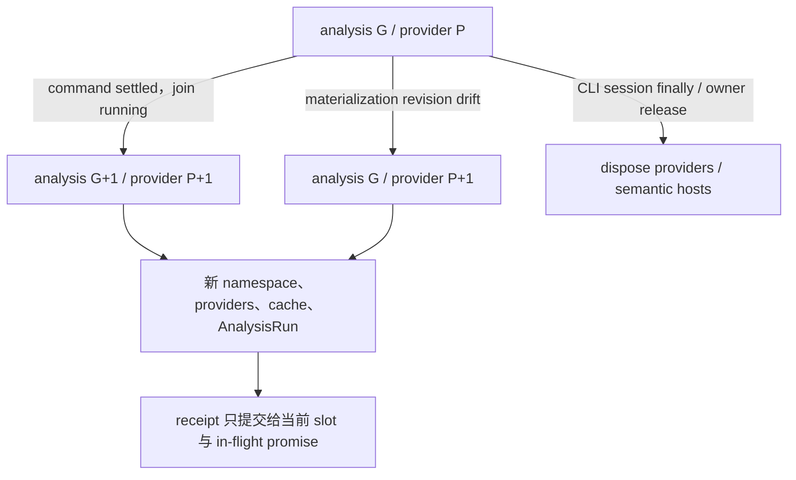

# Limina 生命周期与发布

[English](../lifecycle.md) | [简体中文](./lifecycle.md)

本页拥有 generation、cache、dispose、artifact mutation、migration 与 issue freshness 的完整解释。它们分别保护分析有效期、写入权限、发布完整性和结果新鲜度，不能合并成“所有状态都属于一个 generation”。

## Run、provider generation 与异步发布

[preflight manager](../../../packages/limina/src/preflight/manager.ts) 有 `#generation` 和 `#providerGeneration`。通常 command boundary 推进二者；materialization 因 base revision drift 触发 replan 时，只刷新 providers/namespace/cache，analysis task generation 保持不变。snapshot token 编入 root、两种 generation；数字本身不是物理文件版本。`ResolvedLiminaConfig.governanceRoot` 属于配置解析：最近 manifest 读取并验证一次，然后由根分类与根包构造共享。provider 刷新不产生第二份根 manifest fact，新的配置解析才建立新的根快照。该有界快照不冻结子包 manifest、整个文件系统或第三方工具的读取。

[executor](../../../packages/limina/src/execution/executor.ts) 是当前生产 generation controller 创建入口；[scheduler-loop](../../../packages/limina/src/execution/scheduler-loop.ts) 在 command settlement 标记推进后先 join running，再 startNextGeneration。manager 的 [materialization slot](../../../packages/limina/src/preflight/materialization.ts) 检查当前 slot 和 promise identity，防止旧异步结果覆盖新 receipt，失败后允许新尝试。命令可以改变 filesystem，因此不能只清一个查询结果继续复用旧 providers。

manager 保留 generated artifact application 的所有权。它的 `ensureGraphMaterialized()` 委托给 [materialization](../../../packages/limina/src/preflight/materialization.ts) 中的 `ensurePreflightGraphMaterialized()`，后者是 `materializeGeneratedArtifactPlan()` 唯一的生产调用方。[架构边界守卫](../../../packages/limina/src/__tests__/architecture-boundaries.spec.ts)检查两条调用边：helper 承担实现，但只有 manager 可以调用该 helper。这次提取不改变 generation 推进、replan authority、slot identity 或 receipt publication。

注入 custom providers 的 manager 只支持 generation zero；advance/replan 的检查发生在 dispose 和 replacement 之前，失败不会静默换成默认 providers。`dispose()` 幂等；但 manager 多数 `ensure*` 方法没有统一 disposed guard，不能宣称所有事后 API 调用都会被拒绝。生产调用方负责在 run 生命周期结束后不继续使用它；是否将该限制机械化是[审计风险](./architecture-audit.md#findings)。

释放责任必须沿调用链定位：[CLI check-run](../../../packages/limina/src/cli/check-run.ts) 与 [standalone](../../../packages/limina/src/cli/standalone.ts) 在 `finally` dispose session；[graph export](../../../packages/limina/src/graph-check/runner.ts) 只 dispose 自建 preflight，borrowed preflight/custom providers 的生命周期归 caller。较低层 [pipeline execution](../../../packages/limina/src/pipeline/execution.ts) 可自建 preflight，但没有统一 finally dispose；直接重复调用该内部 API 的生命周期不应借用 CLI 的保证。domain aggregate 的 immutable 视图也不改变这些实际所有权。

## Cache identity 与能力范围

| Cache / context                                                            | Key / lifetime owner                                                                                                                                                                          | Invalidation 与限制                                                                                                                                                                                                                                                          |
| -------------------------------------------------------------------------- | --------------------------------------------------------------------------------------------------------------------------------------------------------------------------------------------- | ---------------------------------------------------------------------------------------------------------------------------------------------------------------------------------------------------------------------------------------------------------------------------- |
| Workspace、checker config、lookup、graph、route                            | [AnalysisProviderSet](../../../packages/limina/src/core/index.ts) 与 preflight promise/cache                                                                                                  | provider replacement 创建新集合；不能把一个 path-keyed map 作为全进程文件监控缓存                                                                                                                                                                                            |
| Region trie、canonical projection、exact classification、source config Set | [WorkspaceRegionPathIndex](../../../packages/limina/src/core/workspace/validated/path-index.ts) instance，由 workspace provider 的 getPathIndex Promise 共享                                  | provider-only replan 同样更换整个 index；不能只清 classification 而保留旧 trie/projection。[preflight regression](../../../packages/limina/src/__tests__/preflight.spec.ts) 在 analysis generation 不变时重绑 alias 并新增 boundary                                          |
| Project dependency collection / preparation                                | [cache](../../../packages/limina/src/core/project-dependencies/cache.ts)：adapter、family、config/options/raw refs/roots、generation、package/resolver/framework identity、workspace boundary | final collection 再含 workspace export policy identity；有 callback 却无 identity 时禁用 final cache；返回 clones 防调用方污染缓存                                                                                                                                           |
| Native facts snapshot                                                      | [identity](../../../packages/limina/src/core/typescript-semantic/identity.ts)：config/options/roots/raw refs/admission boundary 等                                                            | full context 结束前复制完整 resolution/admission/evidence/requirement facts；不得用 roots-only snapshot 的 hasSourceFile() 重算 admission；key 没有 source content digest，正确性依赖 provider 生命周期。边界会影响 ambient evidence，绝非 boundary-independent syntax cache |
| Native live context                                                        | [context](../../../packages/limina/src/core/typescript-semantic/context.ts) 持有 Program、ledger、resolver、maps                                                                              | 方法在 dispose 后拒绝操作；snapshot 保存历史 facts。公开的 readonly Program 字段并不等于对象物理销毁或全对象不可访问                                                                                                                                                         |
| Vue                                                                        | [manager](../../../packages/limina/src/core/vue-semantic/context-manager.ts) 与 process-wide active context slot                                                                              | 同 identity 可共享 owners；切到不同 identity 会替换并 dispose 旧 slot；last owner release 回收。不是每个 provider 独占一份长期 Vue Program                                                                                                                                   |
| Astro                                                                      | [context](../../../packages/limina/src/core/astro-semantic/context.ts) 按 project seed/toolchain 管理，Program lazy                                                                           | snapshot 结合当前 source text；manager dispose 回收 context。外部文件变化仍受整体 provider lifetime 限定                                                                                                                                                                     |
| Svelte                                                                     | [context](../../../packages/limina/src/core/svelte-semantic/context.ts) 单 active project，project identity 含 adapter/options/config closure/package/files/generation/profile                | leaf-owned toolchain；per-file sourceText 缓存与 managed lookup identity 分开；不是通用增量 watcher                                                                                                                                                                          |

native scope-evidence 缓存契约为 semantic context v4、native dependency facts v3、project dependency adapter v6、pending dependency adapter v4；pending clone 同时复制 referenceRequirement。native Core 路径复用既有 provider/query cache、以 Symbol 为键的 ambient cache 与 bounded Program；每次未缓存 project collection 创建一个 context，而非每个 occurrence 创建一个。`completeProject()` 释放 live handle，同时保留已复制 facts；dispose 后拒绝 live-context 操作。[Provider evidence tests](../../../packages/limina/src/__tests__/native-provider-evidence.spec.ts) 断言 Program 创建数、查询复用、snapshot 一致性与释放行为，不预设性能提升。

运行期 project dependency identity 包含 compiler options/conditions、源码文件、authority、extensions、package roots、workspace boundary 与 generation。Native fact cache 也以该 project identity 为键。证据快照在收集与缓存边界复制并冻结，不保留 live framework profile。只有已经观察到的 runtime evidence 才会被复制，克隆不会解析模块。[Project dependency 回归](../../../packages/limina/src/__tests__/project-dependencies.spec.ts)覆盖上下文变化、修改尝试、原生 resource 及框架生成 observation。

Occurrence 快照保留 workspace boundary identity 的 SHA-256 摘要，并以不可变 boundary 对象为键在 WeakMap 中记忆。原始 identity 包含完整路径清单；每个 occurrence/cache clone 都深拷贝该清单，会使内存随 workspace 大小与 import 数量的乘积增长，并曾在仓库验证中耗尽默认 4 GiB 堆。有界快照回归使用 10,000 个 workspace 路径；成员集合不同仍会同时改变 boundary 摘要和 project identity。WeakMap 不会延长已释放 boundary 的生命周期。

[FileOwnerLookup](../../../packages/limina/src/core/build-graph/file-owner-lookup.ts) 的 lexical/canonical 索引与 realpath cache 限于当前 analysis/provider 生命周期。新 provider generation 与 replan 从各自 membership 输入新建索引，缺失或已重绑路径不借用旧 generation 的 owner。它不是 filesystem watcher，也不保证跨任意原地文件编辑的缓存有效性。

**Derived**：仅限运行期的缓存适合受控 run/provider 生命周期。若外部调用者跨文件编辑复用同一 cache/request generation，source content 不在 key 中就可能复用旧结果；这不是现有 CLI 必然 stale 的证据。要支持长期 daemon，必须先定义 mutation/version contract，不能简单扩大缓存寿命。

## 原生持久化分析缓存

`check` 通过 [AnalysisCacheController](../../../packages/limina/src/preflight/analysis-cache.ts)启用本地分析快照。`check [pipeline] --force` 跳过既有持久化模型，执行冷分析，并通过正常发布路径发布本次具备资格的结果。它只阻止跨调用语义恢复；provider 刷新仍可复用本次调用内已验证的内存数据。由于 issue query 不执行分析，[CLI 入口](../../../packages/limina/src/cli/register/check.ts)在配置求值或创建 preflight 前拒绝 `--issues --force`。内部 `analysisCache: false` 与 `read-only` 控制仍保留。checker 的 `.tsbuildinfo` 等构建缓存和 check-result query 保留各自合同。独立 graph/source 入口可读取有效分析数据，但不获得发布权限，其 CLI 参数保持不变。

[Cache identity](../../../packages/limina/src/preflight/analysis-cache-identity.ts)绑定 adapter、实际 compiler/checker/resolver 文件、host 语义、配置入口和治理根。实际模块所属包的 manifest 是工具观测输入，包括字节与绑定；内嵌 migration 不会仅为缓存身份要求安装 Limina 包。[工具观测](../../../packages/limina/src/preflight/analysis-cache-tools.ts)每次调用捕获一次文件字节及绑定，再在消费和发布边界复查绑定、package-scope 选择与元信息。[Context identity](../../../packages/limina/src/core/analysis-cache/identity.ts)绑定 effective compiler options、原始 references、admission 及 pending/locked checker identity。运行时 generation 和完整 workspace 清单不充当 importer version。

[安装环境](../../../packages/limina/src/core/analysis-cache/installation-environment.ts)区分 `observed`、`lockfile-trusted` 和 `unknown`。相关 lockfile 未变化，允许信任其覆盖的 types/lib 安装环境。这是工程信任合同，不是安装字节必然相同的证明。锁文件未变的未观测补装、手工修改及安装方式切换属于已接受边界；实际观测到的不同仍遵守失效／漂移规则。任一相关锁的内容、存在状态或绑定变化，使本配置的解析、native facts 及派生图失效；独立有效的语法、checker `.tsbuildinfo` 和其他治理域仍分开管理。

[安装绑定](../../../packages/limina/src/core/analysis-cache/installation-bindings.ts)从实际物理安装域、包管理器身份和消费项目范围出发，观测选择候选、manifest 和安装设置，不任选仓库根锁。pnpm 成员容器只有在祖先 workspace 与已安装 pnpm 标记一致，且所选 lock 覆盖该成员时，才继承共享安装；更近的独立 lock／安装边界阻止继承。裸 `node_modules` 根也属于安装根，其内容不进入本地目录指纹。受限适配器支持 pnpm 6/9 锁格式的共享、独立和自定义锁位置；简单当前分支锁记录实际 Git HEAD 输入。合并／detached 分支绑定及冲突的项目级锁设置明确回退 unknown。npm 2/3 格式要求覆盖项目条目，旧格式 1 仅支持安装根；同时观测 shrinkwrap 与 package-lock 候选。Yarn 物理 host 要求 classic v1，或通过门槛的现代锁格式、workspace 覆盖及 `nodeLinker: node-modules`；PnP／自定义 host 不获得 native 缓存资格。Bun 文本格式 1/2 要求 workspace 覆盖；二进制 v0 使用字节版本和可用的已安装 Bun decoder，仅支持安装根覆盖。缺失／不可读锁、未知版本和未证明的覆盖不能授予 clean 命中；既有冷分析能力保持有效。 同一 invocation 内，相同 lock 字节版本及 lock／解析根可共享成功的 pnpm 覆盖校验；每个调用方仍观测当前字节与绑定。重复依赖校验直接将当前已观测记录与 expectedVersion 比较，不省略后续漂移检查。Native cache 的 Program 计数只覆盖符合资格的 context；评估整条命令时，必须同时统计框架回退的 bounded 和 provider Program 指标。

保留按 TypeScript 解析语义生效、有序且含继承路径的 typeRoots 清单。[本地指纹](../../../packages/limina/src/core/analysis-cache/directory-fingerprint.ts)递归记录路径、条目类型、普通文件 mtime、缺失／空根及链接／路径身份，排除 node_modules 内容。不读取全部文件内容 hash，也不以父目录 mtime 代替递归扫描。所有纳入的条目均参与，包括未消费及旧时间戳文件。共享目录仅在同一观测轮次复用扫描，后续消费／发布边界重新检查。根变化撤销对应共享语义环境，并通知全部配置订阅者；目录外声明依赖仍独立版本化。同路径内容变化但保留／回退 mtime 可能逃过指纹；仅 touch 可保守触发语义工作。扫描失败是错误，不能视为空目录。

[Inputs](../../../packages/limina/src/core/analysis-cache/inputs.ts)分开保留事实的 expectedVersion 和当前输入表。更新的内容 mtime 触发读取／hash，相同字节不制造内容变化；发布不推进未触碰输入的 checkpoint。存在性、目录、路径和 failed-candidate 观测继续独立生效。manifest 精度仍仅限有序 `imports`／`exports`；字段存在状态、其他解析内容、创建／删除、绑定或覆盖不完整走整域回退。没有 typeHash 或其他 manifest 字段级优化。正常 NodeNext／Node16 包含实际 importer scope 探测和 mode 前提，不将保存的 mode 当成常量。

[配置加载](../../../packages/limina/src/config/loader.ts)在每个独立 CLI 进程中求值当前入口及实际加载的模块闭包，为该命令捕获独立拥有、深冻结的纯数据。Native 加载根据 Node 实际返回的入口格式，为 CommonJS 选择 `require`。[配置模块证据合同](#配置模块证据)规定启动准入、loader 覆盖及不支持通用同进程热更新的边界。求值后未声明／未观测的外部输入变化，不停止或重载本次命令；下个 CLI 进程使用重新求值的结果。[有效配置版本](../../../packages/limina/src/config/analysis-version.ts)将全部用户配置属性及其枚举可见性纳入统一 `configVersion`，不建立配置字段到缓存层的影响矩阵。属性值相同但 enumerable 标志不同，可能选出不同的有效 checker，因此可见性必须参与版本。版本不同，逻辑失效该配置 namespace 下整个分析模型，包括解析、native facts、环境、贡献、ownership／provider 投影、图与索引。独立 checker 缓存、`.tsbuildinfo` 和其他配置 namespace 保持独立。版本相同仍继续所有普通增量输入检查。持续函数／闭包、Proxy 及自定义原型数组保留为可执行或不透明值；版本无法稳定表示时冷分析，不恢复或发布跨调用模型，不通过丢弃函数制造相等。已观测配置代码／模块／治理绑定漂移终止调用，不重放 pipeline。[调用期观测](../../../packages/limina/src/preflight/config-observation.ts)也保护已加载配置，即使持久化缓存读写被关闭。显式本地文件输入使用顶层 `configDependencies`，不增加通用 JavaScript I/O 追踪。

[Context records](../../../packages/limina/src/core/analysis-cache/context-records.ts) 与 [graph records](../../../packages/limina/src/core/analysis-cache/graph-records.ts) 在创建 Program 前校验普通 DTO。完整 clean 原生路径恢复 facts、成员、共享环境、ownership、occurrence 贡献及图投影，不创建分析 Program，不重复关系推导，也不额外完整枚举受信安装类型环境。runtime/resource evidence 和当前判定保留自己的有效性与刷新路径。恢复的生成内容取得新的认证 [artifact plan](../../../packages/limina/src/core/build-graph/analysis-cache.ts)，缺失／变化产物走正常物化。Program、AST、Symbol、host 及写权限不持久化。

[Store](../../../packages/limina/src/preflight/analysis-cache-store.ts)使用授权的 `cache/analysis-v1` namespace、跨进程 lease、精确物理字节基线和原子替换。即使旧数据损坏或不兼容，也保留基线；旧 writer 不能覆盖较新物理快照。provider 刷新可复用内存数据，但不更新发布基线。严格 clean 发布执行输入检查，快照字节、revision、mtime 不变，不 clone／序列化完整模型。即使冷回退 Program 复用了 native facts，相同的逐条 DTO 也保留旧身份；缺省可选字段在落盘前后采用一致表示。恢复 query 观测不复制无人使用的结果，实际 query 返回仍保留隔离。只保留当前记录及依赖。schema 5 的 root 必须同时包含 `configVersion` 和 `configModules`。模块覆盖门及有效配置版本门先于旧模型校验或输入采用。旧 schema、缺失或不一致的模块证据、覆盖不完整及不匹配均冷分析。V1 普通恢复仍读取并 JSON 解码整个快照；root 拒绝只跳过旧模型校验和恢复，不跳过整文件 I/O。未来分片 store 必须先检查小型 root，不匹配时跳过全部旧 scope 块，仅由独立 GC 回收不可达块。存储 I/O 失败可省略更新；观测、漂移和权限失败继续传播，包括携带 filesystem code 的错误。

Force 读取保留精确物理基线，不解码、校验或恢复旧模型。旧模型 revision 不可用于 unchanged 发布快捷路径，因此具备资格的冷分析结果继续经过与普通发布相同的 lease、输入／配置稳定性检查、基线比较及原子替换。Force 不绕过 `configuration-version-unknown`，也不为可执行配置授予持久化资格。

修复信任边界之外的安装变化时，运行 `limina check --force`；指定配置时加上 `--config <path>`。它按当前项目状态刷新分析快照，后续普通 check 可恢复新模型。不删除快照、缓存目录、issue 结果或 checker `.tsbuildinfo`，也不要求强制 TypeScript checker 构建。store 仍根据解析后的绝对配置路径计算 key。

分析漂移最多以新 provider、TypeScript 项目配置解析和成员发现重试一次，继续使用本次冻结的 Limina 配置；事务仅包含分析／候选规划，不重放 checker、命令或产物写入。输出变化保留物化／replan receipt 协议。迟到 epoch 结果不能提交，旧的同 context 实例 dispose 不能释放替代实例。

[生命周期回归](../../../packages/limina/src/__tests__/analysis-cache-lifecycle.spec.ts)、[语义回归](../../../packages/limina/src/__tests__/analysis-cache.spec.ts)及[完整缓存回归](../../../packages/limina/src/__tests__/full-analysis-cache.spec.ts)挑战这些合同。`LIMINA_PROFILE=1` 分别记录 context／graph 恢复、证据来源、probe／scan、读取／hash、Program、native query、投影、clone 及发布。本地测试不证明 Windows／Linux 行为或仓库整体提速。

### 配置模块证据

支持的执行模型是每个 Node 进程运行一次 CLI 命令：进程 A 求值配置、冷分析并发布快照；进程 B 求值当前配置，独立校验快照后才恢复分析。[公开 API](../../../packages/limina/src/index.ts)不暴露 `loadConfig`，重复调用内部加载接口不构成模块热更新合同。“每次 invocation 重新求值”指新的 CLI 进程，不要求清空嵌入应用的全部 CJS／ESM 模块和解析缓存。不持久化求值后的配置对象。单次命令内，已观测配置漂移仍必须在继续使用或发布前中止；cold 不能修复已经过期的配置求值，也不能重放命令。

[加载观测](../../../packages/limina/src/config/input-observation.ts)记录当前字节、实际 mtime、逻辑／物理绑定、治理锚点及成功解析的原始请求、目标、条件和属性。[模块比较](../../../packages/limina/src/preflight/config-module-comparison.ts)在采用旧模型前校验 loader identity、入口存在、成员、解析边、绑定和逐文件内容。模块或边变化，即使求值结果相同，也使整个配置 namespace 失效。退出闭包的 helper 只属于旧比较证据，不成为本轮漂移目标。source／checker 的 `tsconfig + extends` 观测保持独立；旧快照不决定本轮加载闭包。

[逐文件构造](../../../packages/limina/src/preflight/config-module-snapshot.ts)在实际 mtime、绑定和文件类型相同时复用磁盘内容 hash。mtime 不同，包括回拨，仅用已捕获字节 hash 该文件；touch 后内容相同仍可复用。恢复时间戳和绑定可能掩盖内容变化，size／ctime 本身不触发 hash。严格调用内字节／绑定检查独立于跨进程 mtime 信任。纯 metadata 变化不改写 clean 快照的字节、revision 或 mtime。

[实际加载源码](../../../packages/limina/src/config/load-source.ts)区分与磁盘一致的源码和可观测 Loader 输出。模块记录携带源码来源；缺少源码仍为 unknown，没有受支持转换 Loader 时 native 源码替换仍为 incomplete。已观测转换输出使用独立逐模块摘要，每次加载重新计算；即使磁盘 mtime 相同，输出变化也拒绝恢复。`loaderSourceHashes` 和 `loaderSourceBytes` 暴露这部分成本，不持久化转换源码或语法分类。`evaluationMs` 包含 Loader 求值和 Hook 回调，`hookMs` 统计回调内的观测工作但排除被委托的 Loader，`observationMs` 统计求值之外的捕获、依赖注册和稳定性检查。这些时间区间存在重叠，不能作为独占阶段相加。

Runtime Hook 是一等依赖观测机制。配置加载／求值阶段的请求会被记录，包括父路径并未加载的 `createRequire()`；仅过滤已加载父模块会漏掉这种请求。在观测边界复制可迭代 conditions：Node 22.18.0 的 CJS 解析提供 SafeSet，Node 24.11.0 则提供数组；传给 Node 的原始 context 保持不变。保留原始 specifier，不从目标文件名反推，因此 `require('./foo')` 从 `foo/index.js` 改选 `foo.js` 会拒绝旧分析。配置工厂在 Hook 作用域内等待完成。执行到的变量 import 贡献实际解析边和模块，未执行分支不贡献依赖。不再使用 TypeScript AST 扫描、parser identity、动态导入站点列表或语法驱动警告。继续执行的回调／闭包和不透明值仍无法取得有效配置版本，也不能取得持久模型资格。Hook 注销后的导入不在自动覆盖范围内。删除语法表达式不自动提升 unknown：旧 incomplete 快照必须先经过一次 complete 冷发布，后续才可 warm。

[显式文件注册](../../../packages/limina/src/config/file-dependencies.ts)在求值后把顶层 `configDependencies?: string[]` 纳入同一 `ConfigLoadEvidence`、`ConfigModuleSnapshot` 和 `ConfigObservation`。明确文件路径以选定配置文件目录为基准，允许绝对路径和上级路径。归一化声明保留逻辑绑定，并指向按物理路径合并的文件记录；已有模块角色保持不变。缺失文件、悬空链接、创建／删除、改指及声明集合变化均可观测；目录、glob、URL 和非法路径值会报错。声明内容变化使配置 namespace 失效，即使有效配置值相同。缺失状态和别名绑定与字节一起参与调用内稳定性检查，包括只读或禁用缓存的运行。注册无法反向证明此前直接 `fs` 读取时消费的字节相同，外部生产者应在求值与检查期间保持输入稳定。

实现复用 Node 同步 `registerHooks`、文件系统／crypto API 和现有缓存所有者。Webpack 的依赖声明与逐文件快照是可参考机制，但引入其与 compiler 耦合的缓存、CJS `require.cache` 反推或 ESM 静态扫描会增加第二套事实来源，也不能保留原始请求，因此不新增包或通用文件系统 Hook。环境变量、网络、时间、随机值等非文件输入，只在其影响实际进入有效配置数据时受版本保护。隐藏行为沿用 unknown／cold 边界或使用 `--force`；不会推测扫描未声明的 `fs` 读取，也不因此拒绝所有普通配置。

[Loader identity](../../../packages/limina/src/config/loader-identity.ts)包含 backend、运行选项和已安装的 tsx 版本。Limina 通过公共注册 API 创建 tsx scope，只从持久化 URL 移除该注册的精确 namespace，用户 query／hash 和其他 loader mode 保留。注册保持存活以支持配置回调。Native 加载仍保留最小 ESM URL 隔离，因为 CLI 初始化可能已加载配置随后导入的公共库；tsx backend 使用自身注册 namespace，不叠加另一隔离参数。它提供 fresh load 证据，且不重复改写已隔离的 URL，使工厂导入自身 URL 时不会再次求值。不承诺嵌入进程内 Node package／realpath 解析缓存刷新。CJS 递归淘汰、进程级已观测路径注册表和私有 `_pathCache` 修改均移除。

普通 native CJS 在 Node 暴露实际加载源码且其他证据完整时可以恢复。[预加载 CJS 准入](../../../packages/limina/src/config/preloaded-commonjs.ts)拒绝检测到的已缓存配置入口／依赖，不把无法核实的缓存求值当作当前求值。`createRequire` 经同步 resolve／load Hook 观测，单独导入 `node:module` 不会使配置失去资格。Tsx CJS extension hook 可能绕过 Node load／源码观测，因此仍 cold；namespace 归一化本身不能证明完整。[CLI 配置边界](../../../packages/limina/src/cli/command-runtime.ts)在求值前拒绝无法识别的 Node 启动 `--require`、`--import`、`--loader` 及对应 `NODE_OPTIONS` 覆盖。Preload 可先填充 Node package 解析缓存再修改 manifest，此时仅 unknown／cold 仍会执行错误配置。仅当实际解析路径属于已安装的 tsx 包时支持该启动；不单凭包名信任。产品转换应使用 `--config-loader tsx`。任意嵌入和第三方 preload 组合不受支持。被 hook 观测到的程序化源码替换不能静默复用仅依据磁盘的摘要。不透明 scheme、未观测格式和重叠加载仍 incomplete；自动完整性仅限可靠观测到的模块加载事实，不覆盖所有 JavaScript 副作用。替换模块加载机制或启动未等待加载工作的配置不在受支持观测边界内；`configDependencies` 只为本地文件输入补充证据。

验收归属[模块／门禁测试](../../../packages/limina/src/__tests__/config-module-cache.spec.ts)、[生命周期测试](../../../packages/limina/src/__tests__/analysis-cache-lifecycle.spec.ts)和[真实 CLI 进程测试](../../../packages/limina/integration/tests/config-process-cache.spec.ts)。必须先有 warm 正控制，再分别破坏 schema／version／module／incomplete／content／binding／edge；断言应观察旧模型采用或 graph 恢复和 Program 数量，不能只检查最终输出。跨进程用例启动新 Node 进程并复用同一磁盘快照。Loader 可信性用例区分过期求值、不安全恢复和主动 cold。Force、issue-only 查询、禁用／只读缓存、分析失败、严格漂移、clean 发布和真实竞争 writer 保留原合同。性能比较须包含完整命令及加载耗时、磁盘／输出 hash、Program、快照读取／解析／校验／写入成本及体积；测试通过或磁盘零 hash 不证明整体提速或未经测试的平台兼容性。

## Provider 拥有的原始语法复用

[SourceSyntaxFactsCache](../../../packages/limina/src/core/typescript-semantic/syntax-cache.ts) 属于一个 `AnalysisProviderSet`。项目依赖收集和原生 TypeEvidence 借用该实例；两个消费方都不负责释放它。Provider 更换（包括 analysis generation 不变的 provider-only replan）创建新缓存，provider dispose 清空条目。这里没有持久缓存或进程全局语法存储。

Bounded host 只在同步创建原生 Program 期间捕获 [OwnedSyntaxInput](../../../packages/limina/src/core/typescript-semantic/syntax-input.ts)。当前解析配方仅审阅覆盖 TypeScript **6.0.3**；其他编译器版本/实例、外来或框架 AST、解析错误、未知解析字段及作用域外调用使用原 collector。扩展配方必须提供对应的解析差分证据。描述符包含 lexical 文件名、编译器实例/版本、collector 版本、语言 target/variant、script kind、implied format、JSDoc 模式及原生 module-detection 策略。命中还要求完整文本相等；mtime 或 realpath 替换不能证明等价。

条目只保留文本和有序的 plain import records。存入与返回都复制 records，条目不含 AST、Program、Symbol、resolved target、admission、TypeEvidence 或 graph 结论。命中后仍初始化新 AST 的 parent pointers；每个 context 独立登记 triple-slash/lib admission 和 resolution。两个消费方保留现有 semantic identity 和 policy interpretation。这项优化不减少 Program 数量。

初始 LRU 预算为 96 MiB 的文本/字符串/对象存储**估算值**，单项上限为 8 MiB。超大条目绕过；每个描述符只保留最新文本。估算是保守记账，不是 heap/RSS 保证。缓存提供 hit/miss/bypass/eviction 与当前/峰值估算字节；原生 Program 构造和首次 TypeChecker 请求分别记录耗时。异步 phase wall 不是独占 CPU 时间。

可执行反例位于[缓存生命周期](../../../packages/limina/src/__tests__/source-syntax-cache.spec.ts)、[语法差分](../../../packages/limina/src/__tests__/source-syntax-differential.spec.ts)和 [provider replan](../../../packages/limina/src/__tests__/preflight.spec.ts)。覆盖内容变化、调用方修改、lexical alias、错误/外来输入、淘汰、dispose、同 generation 更换、70 个合成源码和 432 组外来解析配方。完整性能结论需要冻结 workload 的对照；这些测试通过本身不证明提速。

## Source 阶段观测

[Source phases](../../../packages/limina/src/source-check/phases.ts) 分离只读准备、Knip 执行/清理和只读 ownership/authority/reporting。Runner 在**现有整体 task 资源声明**下顺序执行。公开 task 仍是 `source:check`，最终 source 结果只发布一次。Knip 失败或清理错误仍阻止后续阶段发布成功。Phase wall 观测不授权其他读取方在 Knip 临时入口可见时并发扫描，也不削弱 manifest、repository、generated-file 或跨进程 lease 约束。

## Namespace、物理身份与 plan

[namespace-core](../../../packages/limina/src/domain/artifacts/namespace-core.ts) 记录 logical root、canonical root、generation token，并通过内部 WeakSet 认证；[artifact plan](../../../packages/limina/src/domain/artifacts/plan.ts) 也认证并关联同一个 token。相同 root 与 numeric generation 的两个新 namespace 不能互换 plan。生产 graph 生成 revisioned plan；内部 unrevisioned plan 构造入口存在，不能把 base-revision 检查泛化到每个 API 输入。

Generated config 身份相对 active workspace root 判定；更高目录里的 `.limina` 名称不应误伤嵌套 workspace 的 source config。[mutation authority](../../../packages/limina/src/utils/mutation/authority-create.ts) 对可信 base 取 canonical identity，检查 logical chain、scope 和 containment；输出定位不自动赋予 mutation 权限。

[identity checks](../../../packages/limina/src/utils/mutation/identity.ts) 使用 lstat/open/fstat、content/hash、device/inode、link/metadata 等组合验证 binding。逻辑 symlink/junction、物理 escape、binding drift 分别有拒绝路径。它们是具体执行 guard，不是对任何操作系统并发攻击都绝对无竞态的证明。

## Generated artifacts 的发布与恢复

生成的声明目录与增量缓存路径在既有 checker 和目录分区内保留完整源配置文件名，包括 `tsconfig.` 和 `.json`，因此 `tsconfig.json` 与 `tsconfig.tsconfig.json` 不再共享路径。规划阶段拒绝不同源配置占用同一路径。重新生成会更新受管配置；过期清理只依据原有所有权清单，不递归删除未登记的编译缓存或用户文件。[Namespace 守卫](../../../packages/limina/src/__tests__/artifact-namespace.spec.ts)与[图重新生成测试](../../../packages/limina/src/__tests__/generated-graph.spec.ts)覆盖路径冲突、旧所有权清单和重复规划。

[materializer](../../../packages/limina/src/core/build-graph/materializer.ts) 的生产路径：

1. 认证 namespace/plan；获得 canonical root 的跨进程 writer lease。
2. 在 lease 内读取 base revision。drift 时最多完整 replan 一次，要求仍是同一 canonical lease root。
3. 写入 in-progress marker，包含 base/desired revision 与 owned-path universe。
4. 写目标文件，删除不再属于目标的旧 owned paths；manifest 最后写。
5. 验证 desired tree 后删除 marker，才完成 receipt。

失败后 marker 保留，reader lease 报 recovery required；下一个 writer 用完整新 plan 恢复并验证后解除 marker。manifest-last 是协议的一环，不是 filesystem 多文件原子事务。恢复没有通用 journal 或 backup tree。Checker typecheck 在可能的重新规划完成后，从物化 receipt 选择目标，包括判断是否没有目标；其[读租约](../../../packages/limina/src/core/build-graph/materialization-read-lease.ts)在启动 checker 前检查当前产物 revision 仍匹配 receipt，漂移时明确失败并要求重新执行命令。Checker build、选定 checker build 和 managed output build 在编译器执行前使用同一 receipt/revision 握手。单独的 reader lease 不能授权旧的内存 classification 消费更新的 generated closure；其他无关产物消费者仍遵循各自协议。[回归覆盖](../../../packages/limina/src/__tests__/typecheck.spec.ts)在规划与物化之间改变 leaf 和 package root，并在取得读租约前替换 receipt。

[manifest version](../../../packages/limina/src/core/build-graph/manifest-version.ts) / [ownership](../../../packages/limina/src/core/build-graph/manifest-ownership.ts) 允许旧格式仅作为 cleanup ownership ledger；当前 schema 定义在生产 types。当前检查时为 v5，v1–4 不作为当前 graph 重用。future/非法版本拒绝。ordering 使用 code-unit comparison；运行时能力描述和 live source descriptors 不因此变成持久化 graph。

这套 namespace materialization 管的是 managed generated artifacts。graph export 的用户目标文件、`build --raw` 的外部工具输出和 migration 有不同 writer contract；不能写成“全部磁盘写入都经过 materializer”。managed checker output 另经 [managed-mutation](../../../packages/limina/src/typecheck/managed-mutation.ts) 与 [output](../../../packages/limina/src/typecheck/output) 校验 authority。

跨进程 holder 通过目录 rename 发布不可变、以 token 命名的 owner record。回收只删除观察到的 record，然后执行非递归 rmdir；替换 holder 的不同 record 会阻止其非空目录被删除。release 使用相同规则。清理中断留下的空已发布 slot 可以恢复；未发布的 reader candidate 不属于 reader membership，不能作为空 lease 被回收。旧 `owner.json` record 可以退役，但不再发布这种格式。这是当前 Limina 进程之间的协作协议；并发运行且递归删除 holder 的旧版二进制不在该协议内。[Lease 回收守卫](../../../packages/limina/src/__tests__/cross-process-lease-reclamation.spec.ts)在另一 writer 获得 slot 时分别延迟 record 删除与目录移除。

Holder 发布的 rename 返回 `EEXIST` 或 `ENOTEMPTY` 时已经证明发生争用；即使该 holder 在后续检查前释放，也应重试。要求它继续存在会把正常释放变成致命持久化错误，包括 check-index 发布期间。存在歧义的 Windows 风格 `EACCES`、`EBUSY`、`EPERM` 仍须以 holder 仍存在为依据；无关 I/O 错误必须继续传播。重试回到现有的有界获取协议，不绕过 owner 验证、失效 owner 回收或 latest-attempt 检查。[发布守卫](../../../packages/limina/src/__tests__/cross-process-lease-holder.spec.ts) 覆盖真实 POSIX 冲突后释放、两种明确冲突错误码对应 holder 已不存在，以及权限与其他错误对照。[并发 CLI 回归](../../../packages/limina/src/__tests__/cli.spec.ts) 拒绝持久化警告，并在查询失败时包含 stdout/stderr。这维护 I11 的发布完整性与 I12 的新鲜度；仅凭 CI 查询退出码无法确定发生了哪一种持久化失败。

独占 declaration publication 在写入、同步和回读前捕获新空文件的 identity。失败时保留该 identity 供回滚；未完成内容必须仍为预期字节的前缀，且 device/inode/mode/link count 相同。已验证文件保留完整 content-hash 检查。每个 parent directory 在创建下一级前单独加入事务 ledger，后续失败不能丢失此前的清理 ownership。无法读取 identity 或外部替换不会授予删除 authority。[Publication 失败守卫](../../../packages/limina/src/__tests__/output-publication-failures.spec.ts)注入 partial write、sync/readback 失败、目录失败和替换，并检查重试与用户文件保留。

## Migration 是另一种事务

`limina-migrate` 拥有迁移规划、事务和新进程校验。构建通过核心包的 export map，将 workspace `limina/internal/*` 模块直接解析到当前核心 `.ts` 源码，将已有 reader、provider、错误类、namespace 与物理守卫作为整体内联。构建拒绝分发路径中的核心模块和同一真实文件的重复实例，不再要求 migration 支持聚合模块。源码所有权仍在核心，verifier 和 renderer 构建进入 migrate 并从该安装位置解析。单次执行中的 authenticated token、错误 constructor、writer queue 与 semantic context 生产消费保持同一副本。I01 的 workspace 权限、I09 的 generation 身份和 I10 的物理写入边界保持原语义。分发细节归[仓库架构](./architecture.md#limina-边界)。

CLI 与 verifier 将两份内嵌源码版本同已安装 migrate 的 self manifest 比较。工具产物版本不一致时在写入前失败，或使新进程输入消费不可用。CLI 在正常配置加载后、写入前，从配置及已验证 governance-root 的锚点观察包版本元数据，显式区分 same/different/not-installed/unavailable。该观察不加载项目 internal 支持，不改变 audit schema、consumability diagnostics 或退出语义。配置导入公开 `limina` 时，仍须在该配置解析依赖的位置安装它；缺包在写入前失败，不改 import、不建 shim、不安装。中立配置在 required TypeScript 与启用的 optional 能力满足时可单独使用 migrate。持久 schema 路径仍归公开 Limina，项目 schema 缺失只产生不阻断的 editor 范围提示。

[migration planner](../../../packages/migrate/src/migration/planner.ts) 在写入前冻结一套配置 overlay、拓扑修改、依赖比较、JSONC 补丁和物理 snapshot。候选 descriptor、默认 checker entry 与 managed source closure 是不同集合。[InputTopologyResult](../../../packages/limina/src/core/build-graph/input-topology.ts) 复用正常 workspace、entry 和 source/solution reader。单次输入读取在 entry 和 solution 收集中共享 region path index；每个后续候选和新进程读取都会创建自己的 index。DependencyAnalysisResult 区分已完成的语义事实与投影/治理诊断；分析不完整绝不是已经证明的空图。Program 缺少有效成员时提供 config/file/stage 输入诊断，不再以 generic error 逃逸。迁移也将意外语义准备失败记录为无法比较，保留可读 source 身份与原生声明。缺失 import observation 即使没有对应治理 finding，也保留 config、file、specifier 与推导阶段。Generation 内的配置 overlay 贯穿 parser、ownership evidence、semantic host 和 cache identity，不增加 manifest 字段或持久 partial-graph authority。

无法读取的文件保留。空文件或格式损坏的 JSONC 按输入失败隔离；受治理字段的重复 key 仍属于编辑歧义，需手动消除。`kind: 'tsconfig'` 的精确 `regions.exclude` 在 outputs 读取前生效，不取消 package 激活；所有受影响的 membership 与 implicit reference 都需修剪。静态配置语法编辑保留模块，不序列化运行时求值结果。不支持的动态导出、歧义 JSONC、无法建立安全基线的既有 visibility cycle，以及隔离后会丢失正常成员的 solution 声明，都会留下明确的未完成结果。激活 regions 内所有可读 source 候选都会规范化，包括独立 named config；规范化不选择新的 checker entry。原生 source 指向 solution 的声明按 membership reader 展开到保留 source 成员，再进行比较，并记录原目标与展开成员。Checker mapping、declaration provider、cycle 和 policy 仍由正常 core 分析处理。未发现的引用目标仅按已发现的激活 config 拓扑分类，不读取目标内容或探测物理路径；这一日志分类不授予关系 authority。纯 named wrapper 通过重定位路径展开；展开时剪除仅含 path 的 wrapper 回边，默认 solution 环通过补偿 membership 断环。可达性相对于展开前保留的 source 集合进行检查。坏具名目标从每个父 solution 中剪除，包括未被选中的 named wrapper。不删除 `extends`，也不承诺原生 build 行为等价。

Compiler options 保持原样。合法既有 outputs 优先于 native 值；有效 noEmit、declaration-only、outFile 和分离目录限制可选 outputs 接入。[Outputs 试加入](../../../packages/migrate/src/migration/output-adoption.ts) 按路径稳定排序，每次都检查完整候选输入链。封闭的 core reader 只在这一只读 outputs 阶段复用一套 package/descriptor 发现快照；overlay 可变，但 root、regions 和 package selection 固定。每个候选重新验证输出声明、稳定可见性与物理输出 authority。末次规划与新进程磁盘验证仍正常发现，不引入全局缓存或写入后的快照复用。仅目录安全不够：descriptor 必须稳定，保留入口及每个入口/solution 的 source 可达集合都必须保留。隐藏自身或其他正常 source 的候选会被拒绝，不因此隔离 source。基线失败不能当成空保护集合；不搜索组合，也不在写入后重新规划。[迁移拓扑测试](../../../packages/migrate/src/__tests__/migration-topology.spec.ts)和[发布 CLI 覆盖](../../../packages/migrate/integration/tests/migration.spec.ts)拥有这些契约。

[Commit groups](../../../packages/migrate/src/migration/commit-groups.ts) 只关联同一 solution 环或共享必要隔离的修改，独立文件不进入全工作区回滚。同一配置路径的修改在执行前合并；不同路径若指向同一物理文件则拒绝执行。Git root 与 dirty-worktree 确认保留既有权限边界。[Transaction execution](../../../packages/migrate/src/migration/transaction/execution.ts) 保留 identity/content/metadata 检查、单链接原子替换及明确非原子的 hardlink 原地写入。可恢复的组失败会恢复该组，并继续独立工作；修改或回滚状态不确定时停止并保留恢复证据。提示结束后的输入漂移会使冻结计划失效；不宣称具有跨进程 writer lease。

[新进程验证](../../../packages/migrate/src/migration/verification.ts)为 check 和 graph 各启动独立 worker，每个进程仅加载一次配置，以保留 CommonJS 支持而不依赖模块热更新。它通过同次发行 Limina 源码内嵌的正常 check/graph 输入读取器加载实际磁盘配置，不使用 overlay 或 report。成功表示该内嵌输入实现消费了磁盘拓扑，不表示执行了任意项目安装版 Limina、完整 typecheck 或 graph 治理。必要写入失败、受保护成员缺失、结构性错误、没有可治理 source 或无法验证时，都不能报告接入成功。单独拒绝可选 outputs 不要求失败。独立发布的 `.limina/migration/latest.json` 记录处理、比较、转换、写入及验证，包括阶段耗时，以及审计位置仍可写时的致命失败尝试。终端结果同时显示隔离配置、删除的域外引用、比较完整性、分析诊断、失败／跳过组和报告路径。治理诊断与源码尚未生成本身不使输入消费失败；残留结构错误或必要写入失败仍会失败；发布失败只警告，不回滚配置。Report 不授予 graph 或后续 migration authority。可编辑模块形态及退出语义见 [CLI 契约](../../../docs/zh/cli.md#limina-migration)。

POSIX checker 执行会持续跟踪所属进程组直到终止，包括组长已经退出的情况。组长自然退出时，即使未取消也会启动后代清理；清理成功后保留组长原始退出状态。组长的 close 事件不再取消强制终止计时。runner 在报告完成前等待进行中的进程组清理；checker host 保留该组直到清理结束，host 关闭时也一样。清理超时有明确上限，并报告为失败的执行结果。[进程组测试](../../../packages/limina/src/__tests__/process-tree.spec.ts)使用响应／忽略信号的子进程、已经退出的组长及直接／host 执行。这些测试不证明 Windows taskkill 的后代终止行为。

## Issue identity 与 freshness

命令帮助是已经完成的 CLI 结果。CAC 打印帮助后会清除 matched command，因此 CLI 在渲染帮助时记录匹配状态，再应用未知命令守卫。全局与嵌套帮助不加载配置、不创建治理产物；未知命令仍失败，包括同时请求帮助的情况。[CLI 测试](../../../packages/limina/src/__tests__/cli.spec.ts)覆盖真实进程及这些副作用对照。

inline 终端写入跟踪转发 chunk 时保留原 Writable 接收者，结束后恢复同一个原始方法。stdout 和 stderr 共用一个流时只包装一次。Buffer/string 编码、callback 和回压仍由流本身负责。[真实 Writable 测试](../../../packages/limina/src/__tests__/terminal-frame.spec.ts)覆盖两种 write 重载及完整 inline reporter。正常的子进程 renderer 与仅状态 reporter 是不同路径；该修复保护子进程 renderer 不可用时的 inline fallback。

Finding producer 保留 typed semantic facts，issue projector 按域组成稳定 identity、去重与排序；同一位置的不同 semantic finding 不能因展示字段相同而吞掉。[check-reporting](../../../packages/limina/src/check-reporting) 定义 canonical issue inventory；terminal presentation 不决定事实 identity。

[check-attempt-io](../../../packages/limina/src/source-check/snapshot/check-attempt-io.ts) 发布 sequence、attempt identity 与 started metadata，完成时提交 `last-run.json` 与认证它的 latest-completed metadata/digest。较旧 completion 不能压过较新 sequence。当前 [snapshot types](../../../packages/limina/src/source-check/snapshot/types.ts) 是 check v8、source v1；standalone [invocation snapshot](../../../packages/limina/src/check-reporting/invocation-snapshot.ts) 是另一个 v1 schema，使用独立 invocation ID。三个版本不能混写。读取器和写入器的拒绝消息从 `CHECK_ISSUE_SNAPSHOT_VERSION` 获取支持的 check 版本；旧版和未来版 check wire model 仍被拒绝。[快照测试](../../../packages/limina/src/__tests__/source-snapshot.spec.ts)与[完成 attempt 测试](../../../packages/limina/src/__tests__/check-attempt.spec.ts)覆盖无效写入、版本拒绝，以及 metadata 一致但快照使用旧版本的情况。

`check --issues` 查询 persisted state，不运行新检查。它的 `QueryConfigAnchor` 与 `ExecutionConfigLocation` 不同：显式路径相对 cwd 做 lexical 解析，可以不存在。locator 从其 dirname 寻找最近 manifest，验证对象，不分类 membership、不 import 配置、不执行配置函数、不构建 preflight。未指定路径时发现当前存在的默认配置，缺少记录不重定向到祖先 workspace。生成的 invocation 命令绑定绝对配置、Node 路径和已安装 Limina binary；[回放测试](../../../packages/limina/src/__tests__/single-package-cli.spec.ts) 删除配置并检查持久化状态不变、配置没有额外执行。latest running/interrupted/aborted/persistence-failed/corrupt metadata 或不一致 completion pair 禁止 fallback 到旧 inventory；corrupt latest attempt 还阻止新 sequence 分配。显式 standalone invocation query 有自己的输入校验，不等于 latest full check。

完成状态、失败状态、未运行与 inventory 不可用需要分开输出；机器 JSON/NDJSON 和人类文本可不同展示，但不能把不可用输出为本轮零问题。`LIMINA_PROFILE=1` 的性能观测也不改变 issue authority；profile/snapshot 的 atomic writer 不等于整个 check 的跨文件原子性。

自定义条件 DAG 摘要保留既有诊断身份的集合，每个身份在阶段上下文中只有一个 finding 对象。共享路径合并身份，不再按每条引用路径复制诊断数组；默认域与命名域共享已发布身份集合，并在各自阶段内按稳定的身份顺序发布 finding。项目路径可达性以及预期/实际条件信息保持完整。诊断存储槽位的上界因此是项目数乘不同 mismatch 数，而不是路径数；这不代表总内存线性，因为可达性集合仍是传递集合。[对抗性 DAG 测试](../../../packages/limina/src/__tests__/condition-subtree.spec.ts) 对照直接边 oracle、逆序项目遍历、深/宽菱形、条件一致及重叠域。

## Release registry 快照生命周期

[Release 命令执行](../../../packages/limina/src/commands/release/command.ts)在受异常处理保护的命令流程内、entry 调度前加载 registry 配置。环境变量与相关 npmrc 条目只复制一次，各依赖随后从该配置中选择 authority。authority 随 metadata、baseline 和 tarball 调用传递；请求 helper 不再读取进程环境变量。metadata 复用仍限定在 release consistency state 内，以完整规范化 registry base URL 加包名作为缓存键；不会缓存某条 importer 边的 baseline/ignore 决策。之后修改文件或环境变量只影响后续调用。URL 与响应上限见[release 网络 authority](./system-model.md#release-registry-authority)；该快照不改变 provider generation 或 issue attempt 的生命周期。
